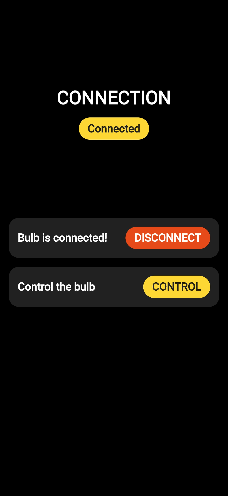
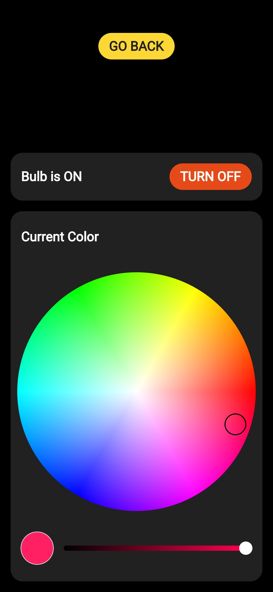

# RGBulb App

An Android app to control our IoT RGB LED module.

Collaborated with [Emre Urcu](https://github.com/emreurcu), [Enes Altıngemi](https://github.com/ealtingemi) and [Kübra Tunç](https://github.com/kubratunc).

## Snapshots

